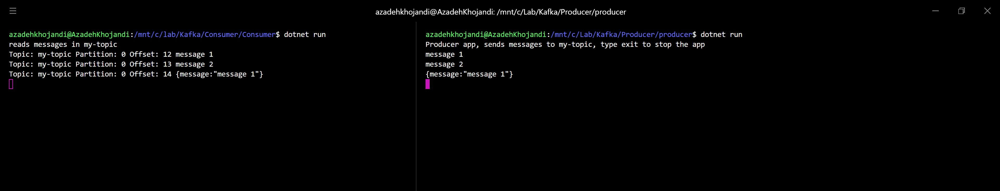

### Option 1: 

* Setp 1: Install kafka on your local machine directly 

Run `./0-download-kafka.sh` , `./1-start-kafka-zookeeper.sh` and `./2-start-kafka-server.sh` and `./3-create-topic.sh`

* Setp 2: monitor and test

1. Run `./kafka-status.sh`, it should return back list of topics and brokers
2. Run `./4-start-producer.sh my-topic` in one terminal and leave it open and  Run `./5-start-consumer.sh my-topic` in another terminal.
If you type a message in producer and hit enter the message will appears in consumer terminal.

### Option 2: 

* Setp 1: Install kafka on your local machine via docker
Run `docker-compose up -d`

* Setp 2: monitor and test

1. Run Producer app in one terminal and leave it open
`cd Producer`
`dotnet restore`
`dotnet build`
`cd producer`
`dotnet run`

1. Run consumer in another terminal and leave it open 
`cd Consumer`
`dotnet restore`
`dotnet build`
`cd Consumer`
`dotnet run`

## Hints
If you run the dotnet code on windows and run your docker file on Linux sub system (wsl) you might get the following issue:

0.0.0.0:9092/bootstrap: Connect to ipv4#0.0.0.0:9092 failed: The requested address is not valid in its context... (after 1000ms in state CONNECT)
1/1 brokers are down

The solution for it is running the consumer and producer app on  Linux sub system (wsl) too.

####  Install .Net Core 2.2 on UBuntu 

`curl https://packages.microsoft.com/keys/microsoft.asc | gpg --dearmor > microsoft.gpg`
`sudo mv microsoft.gpg /etc/apt/trusted.gpg.d/microsoft.gpg`
`sudo sh -c 'echo "deb [arch=amd64] https://packages.microsoft.com/repos/microsoft-ubuntu-bionic-prod bionic main" > /etc/apt/sources.list.d/dotnetdev.list'`

`sudo apt-get install apt-transport-https`
`sudo apt-get update`
`sudo apt-get install dotnet-sdk-2.2`

## References 
https://kafka.apache.org/quickstart
https://github.com/confluentinc/confluent-kafka-dotnet
https://www.hugopicado.com/2017/11/22/getting-started-with-net-core-and-kafka.html
https://github.com/wurstmeister/kafka-docker
https://github.com/confluentinc/cp-docker-images/blob/master/examples/cp-all-in-one/docker-compose.yml
https://github.com/edenhill/librdkafka/blob/master/CONFIGURATION.md

